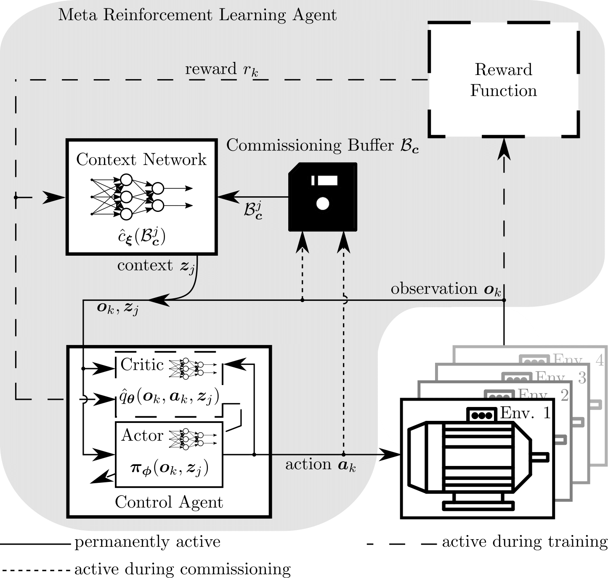
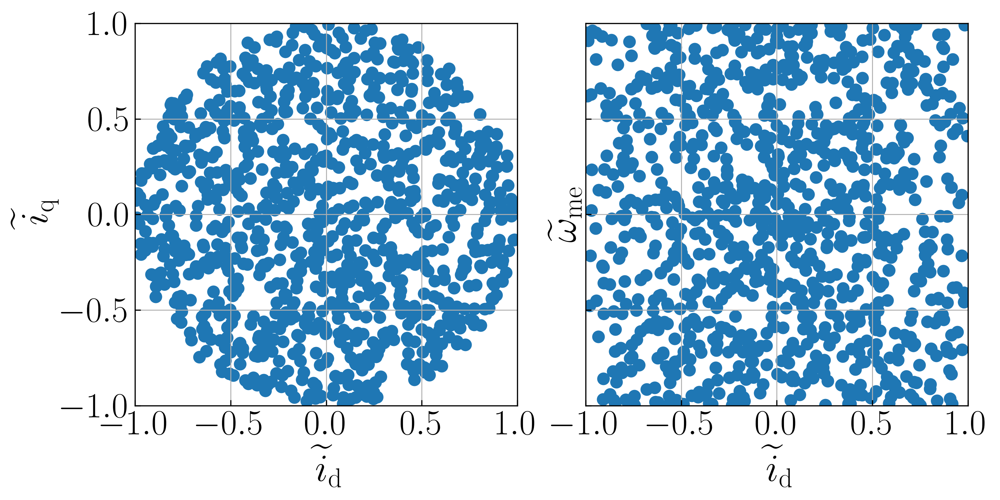

# meta_RL_PMSM
This repository provides the associated engine database and code to the paper Meta Reinforcement Learning-Based Current Control of Permanent Magnet Synchronous Motor Drives for a Wide Range of Power Classes. It aims to allow the reader to reproduce all the results as well as draw inspiration from the code. If you use any sections from the code or the engine database for your publications, please cite this paper as follows:

....

## General Setup

<p align="center">  </p>

## Engine Database

For this paper a big number of physical motor drive parameters from a wide range of power classes was collected. You can find them [here](MotorDB/Complete.xlsx). 

### Parameter Selection for Training and Test

In order to achieve a balanced coverage of the parameter space, a thought out preselection of training and test parameters was made. This was based on a representation of the parameters that should describe the dynamics of a motor in normalized space. The script can be found and executed in [Dataset_Sampling.py](Code/Data_Selection/Dataset_Sampling.py). Executing it as it is will create the physical parameter sets [training](MotorDB/Training.xlsx) and [test](MotorDB/Test.xlsx) as well as the normalized dynamics parameter set [training](MotorDB/ODETraining.xlsx) and [test](MotorDB/ODETest.xlsx) which are used in this work. To derive different sets, the random states in the script have to be altered.

## Commissioning Buffer Sampling

<p align="center">  </p>

This thesis' context was designed to be static. Therefore, a comprehensive input had to be selected. This was done by sampling the state/action space using [DESSCA](https://github.com/max-schenke/DESSCA). Executing the script [DESSCA_Sampling.py](Code/Data_Selection/DESSCA_Sampling.py) will result in samples which will be used to gather data for the commisioning buffers from the motors. These samples are saved in the [DESSCA_Samples](Save/DESSCA_Samples/) folder. Additionally, [test episode initializations](Save/DESSCA_Samples/test_routine_samples.npy) are sampled and saved with the execution of the DESSCA_Sampling.py script.

## Starting a Training

The (meta-)training can be started using script [meta_train.py](Code/Routines/meta_train.py). You have to specify the rollout steps per motor drawn, the total number of rollout steps over all motors until training ends and the number of rollout steps after which a checkpoint is created. Using the same values as used in this work this would be

```
meta_train.py 1000 5000000 100000
```
Optionally, using the -tr and -te flags respectively, one can specify a path to the training and test motor parameter sets. Default paths are those of [training](MotorDB/Training.xlsx) and [test](MotorDB/Test.xlsx). The -s flag can be used to specify a save path for the training checkpoints - default is the [Trainings](Save/Trainings) folder. If the -n flag is not specified, the training routine will create a new folder in the [Trainings](Save/Trainings) folder, depicting the datetime of the training start. Alternatively, the -n flag can be used to define a different name. The -c flag can be used to set the amount of context variables used - default is 8. For example a training without a context network could be started using

```
meta_train.py 1000 5000000 100000 -c 0 -n no_context
```
The hyperparameters of the agent have to be changed directly in the script. The default values are the same as used for the models used in the paper. For the [MRL](Save/Trainings/MRL) and [RL_AM](Save/Trainings/RL_AM) agents used for the in depth analysis presented in the paper, the respective checkpoints are provided in the repository. We omitted publishing training rewards to not bloat this repository's size.
